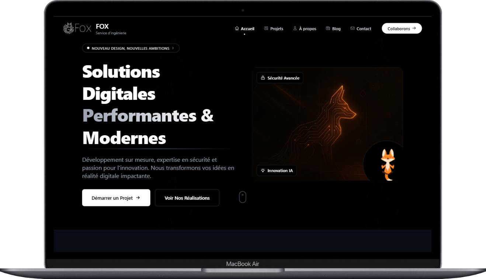
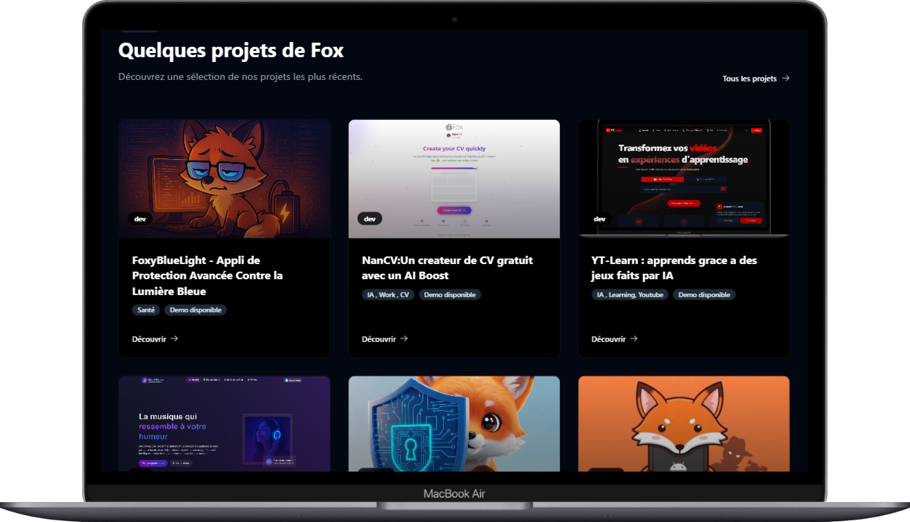
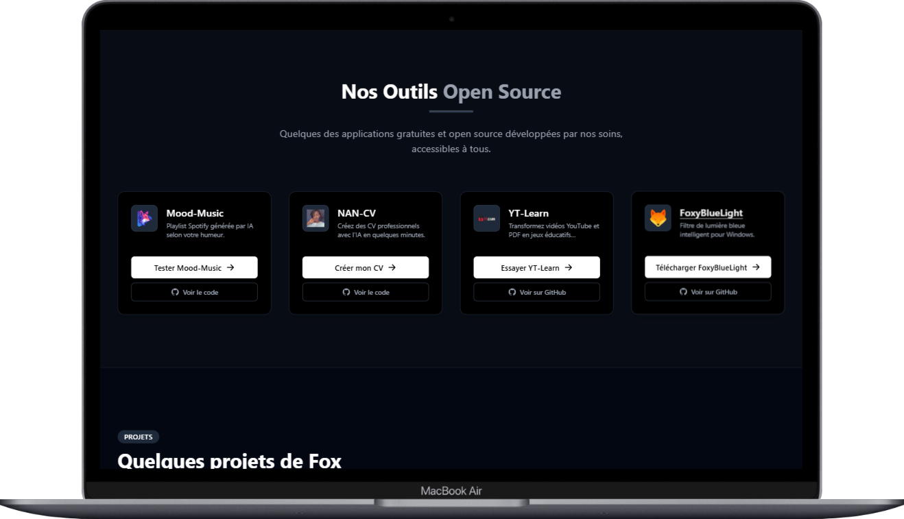

# Fox Portfolio & Blog

<div align="center">
  
  <p><em>Fox Engineering - Portfolio et Blog professionnel</em></p>
</div>


## 📚 Sommaire

- [Introduction](#-introduction)
- [Fonctionnalités](#-fonctionnalités)
- [Captures d'écran](#-captures-décran)
- [Technologies utilisées](#-technologies-utilisées)
- [Architecture](#-architecture)
- [Installation](#-installation)
- [Structure du projet](#-structure-du-projet)
- [Authentification](#-authentification)
- [Communication API](#-communication-api)
- [Problèmes connus](#-problèmes-connus)
- [Déploiement](#-déploiement)
- [À propos de l'auteur](#-à-propos-de-lauteur)
- [Licence](#-licence)
- [Contact](#-contact)

## 📝 Introduction

Fox Portfolio & Blog est une application web moderne et élégante conçue pour présenter le portfolio, le blog et les services de Fox Engineering. Développée avec React et TypeScript côté frontend et Django Rest Framework pour le backend, cette application offre une expérience utilisateur fluide avec un design adaptatif et des animations élégantes.

L'application permet aux visiteurs de découvrir les projets réalisés, lire des articles de blog, laisser des commentaires, envoyer des messages via un formulaire de contact et s'abonner à une newsletter. Une interface d'administration sécurisée est également disponible pour gérer le contenu et envoyer des newsletters aux abonnés.

> **Notre vision :** Présenter l'expertise technique et les connaissances de Fox Engineering dans un environnement moderne, performant et visuellement attrayant.

## ✨ Fonctionnalités

### Fonctionnalités principales

- **Portfolio de projets** : Présentation des projets réalisés avec détails et illustrations
- **Blog professionnel** : Articles techniques avec système de commentaires
- **Formulaire de contact** : Communication directe avec l'administrateur
- **Abonnement newsletter** : Système d'abonnement pour rester informé des dernières actualités
- **Administration sécurisée** : Interface protégée pour gérer le contenu
- **Envoi de newsletters** : Création et envoi de newsletters aux abonnés
- **Mode sombre/clair** : Interface adaptable aux préférences de l'utilisateur
- **Responsive Design** : Expérience optimisée sur tous les appareils

### Sections du site

- **Accueil** : Présentation générale et points forts
- **Projets** : Portfolio des réalisations avec filtrage par catégorie
- **Blog** : Articles techniques avec possibilité de commentaires
- **À propos** : Présentation détaillée de l'auteur et parcours
- **Contact** : Formulaire de contact et informations de contact
- **Administration** : Interface pour la gestion du contenu (réservée à l'administrateur)

## 📸 Captures d'écran

### Page d'accueil
<div align="center">
  
  <p><em>Interface principale avec présentation des services et compétences</em></p>
</div>

### Blog et Articles
<div align="center">
  
  <p><em>Section blog avec articles techniques et système de commentaires</em></p>
</div>

### Administration Newsletter
<div align="center">
  
  <p><em>Interface d'administration pour l'envoi de newsletters aux abonnés</em></p>
</div>

### Mode Sombre
<div align="center">
  
  <p><em>L'application propose un mode sombre élégant pour une expérience visuelle optimale</em></p>
</div>

## 🛠 Technologies utilisées

### Frontend
- **React 18** : Bibliothèque JavaScript pour l'interface utilisateur
- **TypeScript** : Typage statique pour un code plus robuste
- **Tailwind CSS** : Framework CSS utilitaire pour un design moderne et responsive
- **Framer Motion** : Bibliothèque d'animations pour des transitions fluides
- **React Router 6** : Gestion avancée des routes et navigation
- **Axios** : Client HTTP pour les requêtes API
- **DOMPurify** : Sécurisation du contenu HTML

### Backend (intégration)
- **Django Rest Framework** : Framework API RESTful robuste
- **JWT Authentication** : Authentification sécurisée par tokens
- **PostgreSQL** : Base de données relationnelle performante

### Outils de développement
- **Vite** : Outil de build ultra-rapide pour le développement moderne
- **ESLint & Prettier** : Outils de qualité de code et formatage
- **Git & GitHub** : Gestion de versions et collaboration
- **Netlify/Vercel** : Déploiement continu du frontend

## 🏗 Architecture

L'application suit une architecture moderne basée sur les composants React avec une séparation claire des responsabilités:

### Architecture générale
- **Components** : Composants UI réutilisables (formulaires, cartes, boutons...)
- **Pages** : Composants de page correspondant aux routes
- **Context** : Gestion de l'état global (authentification, thème...)
- **Services** : Communication avec l'API et logique métier
- **Hooks** : Logique réutilisable et gestion d'état
- **Types** : Définitions TypeScript pour le typage strict
- **Utils** : Fonctions utilitaires et helpers

### Flux de données
1. L'utilisateur interagit avec l'interface (composants React)
2. Les actions déclenchent des appels aux services API
3. Les services communiquent avec le backend via Axios
4. Les réponses sont typées et traitées
5. L'état est mis à jour et l'interface re-rendue

## 🚀 Installation

Pour installer et exécuter Fox Portfolio & Blog localement, suivez ces étapes:

### Prérequis
- Node.js 16+ et npm/yarn
- Git

### Installation du frontend

```bash
# Cloner le dépôt
git clone https://github.com/thetigerfoxx/fox-portfolio.git

# Accéder au répertoire
cd fox-portfolio

# Installer les dépendances
npm install
# ou
yarn install

# Créer un fichier .env basé sur .env.example
cp .env.example .env
# Configurez les variables d'environnement

# Lancer le serveur de développement
npm run dev
# ou
yarn dev
```

L'application sera disponible à l'adresse [http://localhost:3000](http://localhost:3000).

### Variables d'environnement requises

```
VITE_API_BASE_URL=http://localhost:8000
VITE_SITE_URL=http://localhost:3000
VITE_SITE_NAME=Fox Engineering
VITE_AUTH_TOKEN_EXPIRY=86400
```

## 📁 Structure du projet

```
fox-portfolio/
├── public/                 # Fichiers statiques
│   ├── images/             # Images globales
│   ├── favicon.ico         # Favicon
│   └── noise.png           # Texture de fond
│
├── src/
│   ├── assets/             # Ressources importées dans le code
│   │   ├── images/         # Images utilisées dans les composants
│   │   └── lotties/        # Animations Lottie
│   │
│   ├── components/         # Composants réutilisables
│   │   ├── common/         # Composants génériques (boutons, inputs, etc.)
│   │   ├── layout/         # Composants de mise en page (Header, Footer, etc.)
│   │   └── ...             # Autres catégories de composants
│   │
│   ├── context/            # Contextes React
│   │   └── AuthContext.tsx # Contexte d'authentification
│   │
│   ├── hooks/              # Hooks personnalisés
│   │   ├── useApi.ts       # Hook pour les appels API
│   │   └── useDebounce.ts  # Hook pour le debounce
│   │
│   ├── pages/              # Composants de page
│   │   ├── HomePage.tsx    # Page d'accueil
│   │   ├── ProjectsPage.tsx # Page des projets
│   │   ├── BlogPage.tsx    # Page du blog
│   │   ├── BlogPostPage.tsx # Page d'article
│   │   ├── AboutPage.tsx   # Page à propos
│   │   ├── ContactPage.tsx # Page de contact
│   │   ├── LoginPage.tsx   # Page de connexion
│   │   ├── admin/          # Pages d'administration
│   │   └── ErrorPage.tsx   # Page d'erreur 404
│   │
│   ├── services/           # Services (API, auth, etc.)
│   │   ├── api.ts          # Service API principal
│   │   ├── auth.ts         # Service d'authentification
│   │   └── index.ts        # Export des services
│   │
│   ├── types/              # Types TypeScript
│   │   ├── api.types.ts    # Types liés à l'API
│   │   ├── blog.types.ts   # Types liés au blog
│   │   ├── projects.types.ts # Types liés aux projets
│   │   └── index.ts        # Export des types
│   │
│   ├── utils/              # Utilitaires
│   │   ├── formatters.ts   # Fonctions de formatage
│   │   └── seo.ts          # Utilitaires SEO
│   │
│   ├── App.tsx             # Composant racine
│   └── main.tsx            # Point d'entrée
│
├── .env.example            # Exemple de variables d'environnement
├── package.json            # Dépendances et scripts
├── tsconfig.json           # Configuration TypeScript
├── tailwind.config.js      # Configuration Tailwind CSS
└── vite.config.ts          # Configuration Vite
```

## 🔐 Authentification

Le système d'authentification utilise JSON Web Tokens (JWT) pour sécuriser l'accès aux fonctionnalités d'administration.

### Flux d'authentification

1. L'utilisateur saisit ses identifiants sur la page de connexion
2. Une requête est envoyée à `/api/auth/token/`
3. En cas de succès, le token est stocké dans le localStorage
4. Le contexte d'authentification est mis à jour
5. Les routes protégées deviennent accessibles

### Protection des routes

```tsx
// Exemple de protection de route
<Route 
  path="/admin/newsletter" 
  element={
    <ProtectedRoute>
      <AdminNewsletterPage />
    </ProtectedRoute>
  } 
/>
```

Le composant `ProtectedRoute` vérifie l'état d'authentification et redirige vers la page de connexion si nécessaire, tout en conservant l'URL de destination pour une redirection après connexion.

## 🌐 Communication API

La communication avec l'API backend est centralisée dans le service `apiService` qui utilise Axios pour les requêtes HTTP.

### Service API

```typescript
// Extrait du service API
class ApiService {
  private api: AxiosInstance;
  
  constructor() {
    this.api = axios.create({
      baseURL: import.meta.env.VITE_API_BASE_URL,
      headers: {
        'Content-Type': 'application/json',
      },
    });
    
    // Configuration des intercepteurs pour la gestion des tokens
    this.setupInterceptors();
  }
  
  // Méthodes HTTP
  public async get<T>(url: string, config?: AxiosRequestConfig): Promise<AxiosResponse<T>> {
    return this.api.get<T>(url, config);
  }
  
  public async post<T>(url: string, data?: any, config?: AxiosRequestConfig): Promise<AxiosResponse<T>> {
    return this.api.post<T>(url, data, config);
  }
  
  // ...autres méthodes
}

export const apiService = new ApiService();
```

### Hook useApi personnalisé

Pour faciliter l'utilisation de l'API dans les composants, un hook personnalisé `useApi` est fourni:

```typescript
// Exemple d'utilisation dans un composant
const { data: projects, loading, error } = useApi<Project[]>({
  endpoint: '/api/projects/?category=web',
  loadOnMount: true
});
```

## 🐛 Problèmes connus

### Problème d'API pour les commentaires

Un problème est actuellement connu avec l'endpoint GET `/api/posts/<post_id>/comments/` qui renvoie une erreur 405 (Method Not Allowed). Ce problème doit être résolu dans le backend en modifiant la vue pour accepter les requêtes GET en plus des requêtes POST.

#### Solution temporaire
Le frontend implémente une solution de contournement en attendant la correction du backend:
1. Désactivation du chargement automatique des commentaires via useApi
2. Utilisation d'une fonction fetchComments personnalisée
3. Récupération des commentaires via un endpoint alternatif

### Autres problèmes connus
- Token d'authentification sans gestion d'expiration automatique
- Pas de rafraîchissement automatique du token

## 🚢 Déploiement

### Compilation pour la production

```bash
# Construire l'application pour la production
npm run build
# ou
yarn build
```

Les fichiers de production seront générés dans le répertoire `dist/`.

### Options de déploiement

#### Netlify
1. Connectez votre compte GitHub à Netlify
2. Sélectionnez le dépôt
3. Configurez les paramètres de build:
    - Build command: `npm run build`
    - Publish directory: `dist`
4. Configurez les variables d'environnement
5. Déployez!

#### Vercel
1. Importez votre projet GitHub
2. Configurez les variables d'environnement
3. Déployez avec les paramètres par défaut

## 👤 À propos de l'auteur

<div align="center">
  
  <h3>The Tiger Fox</h3>
  <p>Développeur Full Stack & Computer Engineering Scientist</p>
</div>


---

<p align="center">
  
  <br>
  <em>Fox Engineering - Computer Engineering & Web Development</em>
  <br>
  <a href="https://github.com/thetigerfoxx/fox-portfolio">GitHub</a> |
  <a href="https://thetigerfoxx.tech">Site Web</a>
</p>